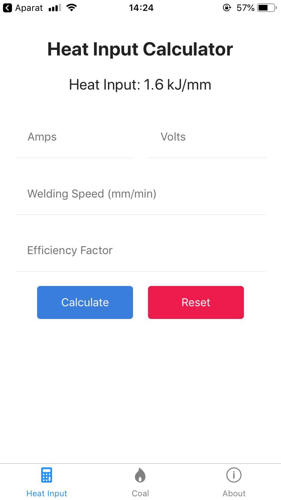

# Welding Toolbox 🛠️

> An app containing a set of useful welding tools, written in React Native ⚛️

## Installation

Currently, only the Android version is available.

[![Google Play Download][google-play-badge]][google-play-download]

or

[Download latest release](https://github.com/xxczaki/welding-toolbox/releases/latest)

## Usage

```bash
# Install dependencies
$ npm install

# Start the Expo Packages
$ npm start

# Build for Android
$ npm run android
```

## Screenshot



### License

MIT

[google-play-badge]: https://play.google.com/intl/en_us/badges/images/badge_new.png
[google-play-download]: https://play.google.com/store/apps/details?id=com.kepinski.weldingtoolbox
